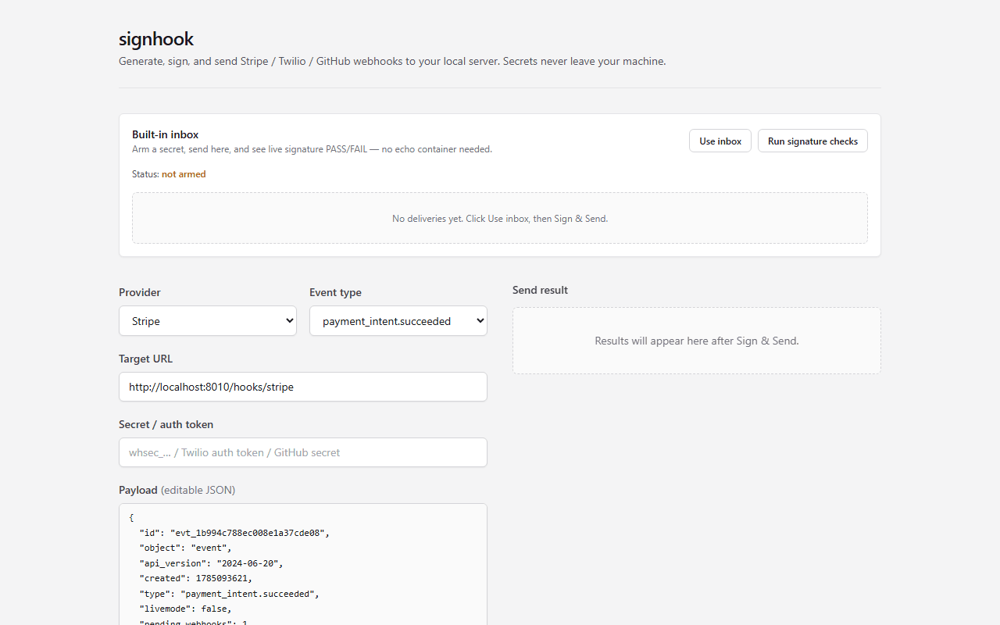

# signhook

**Stop hand-crafting curl commands and reverse-engineering signature schemes to test webhooks.**

If you've ever debugged a failing Stripe/Twilio/GitHub integration by squinting at signature headers, this is for you.

Generate realistic Stripe, Twilio, and GitHub webhook payloads, sign them the way those providers actually do, and send them to your local server — with a clear diagnosis when verification fails.

**Status:** MVP. Core flows work for three providers; PRs for new providers are welcome.



---

## Quick start

```bash
git clone https://github.com/krish-mittal1/signhook.git
cd signhook
docker compose up --build
```

Open **http://localhost:3000**

That’s it. No accounts, no hosted SaaS, no extra config.

| Service  | URL                   |
|----------|-----------------------|
| UI       | http://localhost:3000 |
| API      | http://localhost:8000 |
| Inbox    | `http://127.0.0.1:8000/hooks/{provider}` |

Click **Use inbox**, paste a secret, then **Sign & Send** — the built-in inbox verifies the signature live (PASS/FAIL). Point `target_url` at your own app (or ngrok) whenever you’re ready. Use **Run signature checks** to fire good + deliberately bad deliveries through the real HTTP path.

---

## How it works

1. **Pick a provider** and event type (loaded from the API — not hardcoded in the UI).
2. **Generate a payload** — realistic JSON (Stripe/GitHub) or form-style params (Twilio). Edit freely in the textarea.
3. **Use inbox** (optional but recommended) — arms the built-in verifier with your secret and sets the target URL.
4. **Sign & Send** — the backend signs with the real provider scheme and POSTs to your `target_url`.
5. **See the result** — send status, inbox PASS/FAIL with detail, and a plain-English diagnosis on outbound failure.

---

## Trust: secrets stay on your machine

signhook is **local-only**. You paste webhook secrets / auth tokens into the UI; they are used only by the process running on your computer. Nothing is uploaded to a third-party service. That is intentional — and the main reason this is not a hosted product.

**Why local, not hosted:** no account, no hosted service ever touches your secrets, and the whole tool runs entirely on your machine.

---

## Supported providers

| Provider | Events | Signature Header |
|----------|--------|------------------|
| **Stripe** | `payment_intent.succeeded`, `customer.created`, `invoice.paid` | `Stripe-Signature` |
| **Twilio** | `message.received`, `call.completed` | `X-Twilio-Signature` |
| **GitHub** | `push`, `pull_request`, `issues` | `X-Hub-Signature-256` |

---

## Run without Docker

**Terminal 1 — API**

```bash
cd backend
python -m venv .venv
# Windows: .\.venv\Scripts\activate
# macOS/Linux: source .venv/bin/activate
pip install -r requirements.txt
uvicorn main:app --reload --host 127.0.0.1 --port 8000
```

**Terminal 2 — UI**

```bash
cd frontend
cp .env.example .env.local   # NEXT_PUBLIC_API_URL=http://localhost:8000
npm install
npm run dev
```

Open **http://localhost:3000**.

The API’s built-in inbox lives at `http://127.0.0.1:8000/hooks/{provider}` after you click **Use inbox** (no separate echo process required).

---

## Offline signature harness

```bash
cd backend
python tests/verify_signatures.py
# with API running:
#   python tests/smoke_inbox.py
```

Confirms Stripe, Twilio, and GitHub signing match independent verifiers (including Twilio’s official algorithm).

---

## License

MIT — see [LICENSE](LICENSE).
